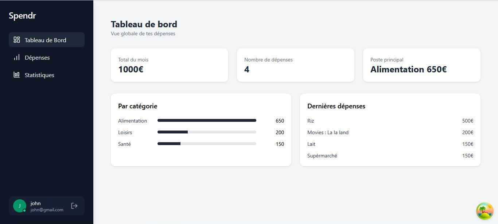
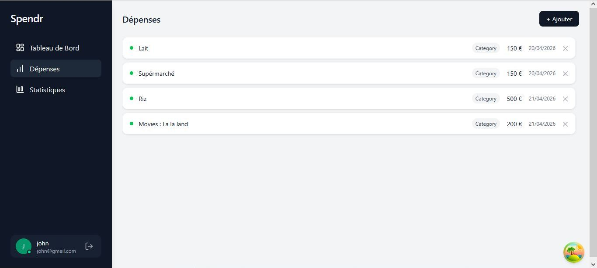

# 💸 Expense Tracker

Application web de gestion de dépenses personnelles, construite avec React et Node.js, entièrement conteneurisée avec Docker.

---

## 📸 Aperçu




---

## ✨ Fonctionnalités

- 🔐 Authentification sécurisée avec JWT (inscription / connexion)
- ➕ Ajout et suppression de dépenses par catégorie
- 📊 Dashboard avec résumé du mois en cours
- 📈 Page Statistiques avec graphique en barres par catégorie
- 🗂️ Gestion des catégories personnalisées
- 🐳 Entièrement conteneurisé avec Docker

---

## 🛠️ Stack technique

| Couche           | Technologie                    |
|------------------|--------------------------------|
| Frontend         | React 19 + Vite + TypeScript   |
| Backend          | Node.js + Express + TypeScript |
| Base de données  | PostgreSQL + Prisma ORM        |
| Conteneurisation | Docker + Docker Compose        |

---

## 🚀 Lancer le projet

### Option 1 — Avec Docker *(recommandé)*

**Prérequis :** [Docker](https://www.docker.com/) installé sur votre machine

#### Variables d'environnement

Avant le premier lancement, créer le fichier `backend/.env` :

```env
DATABASE_URL="postgresql://postgres:postgres123@db:5432/expense_db"
JWT_SECRET="votre_secret_ici"
```

```bash
# Premier lancement
docker compose up --build

# Lancements suivants
docker compose up
```

---

### Option 2 — Sans Docker *(installation locale)*

**Prérequis :**
- [Node.js](https://nodejs.org/) v18 ou supérieur
- [PostgreSQL](https://www.postgresql.org/) installé et en cours d'exécution

**1. Cloner le projet**

```bash
git clone https://github.com/votre-utilisateur/expense-tracker.git
cd expense-tracker
```

**2. Configurer le Backend**

```bash
cd expense_backend
npm install

# Copier et remplir les variables d'environnement
cp .env.example .env
# → Renseigner DATABASE_URL et JWT_SECRET avec vos informations

# Appliquer les migrations de base de données
npx prisma migrate dev

# Démarrer le serveur
npm run dev
```

**3. Configurer le Frontend** *(dans un nouveau terminal)*

```bash
cd expense_frontend
npm install
npm run dev
```

---

## 🌐 Accès aux services

| Service  | URL                   |
|----------|-----------------------|
| Frontend | http://localhost:5173 |
| Backend  | http://localhost:3001 |

---

## 📁 Structure du projet

```
expense-tracker/
|
├── expense_backend/               # API REST Express + TypeScript
│   ├── src/
│   │   ├── controllers/           # Logique métier des routes
│   │   ├── routes/                # Définition des endpoints API
│   │   ├── middlewares/           # Middlewares Express (auth)
│   │   ├── validators/            # Validation des données entrantes
│   │   └── lib/                   # prisma
│   ├── prisma/
│   │   ├── schema.prisma          # Modèles de base de données
│   │   └── migrations/            # Historique des migrations
│   ├── .env                       # Variables d'environnement (non versionné)
│   ├── .env.example               # Exemple de configuration
│   └── Dockerfile
│
├── expense_frontend/              # Application React + Vite + TypeScript
│   ├── src/
│   │   ├── api/
│   │   ├── components/
│   │   ├── pages/
│   │   └── types/
│   └── Dockerfile
│
└── docker-compose.yml             # Orchestration des services
```
---

## 🔐 Sécurité

- Les mots de passe sont hashés avec **bcrypt**
- L'authentification utilise des **tokens JWT**
- Les routes protégées vérifient le token via un middleware dédié
- Le fichier `.env` est exclu du versionnement via `.gitignore`

---